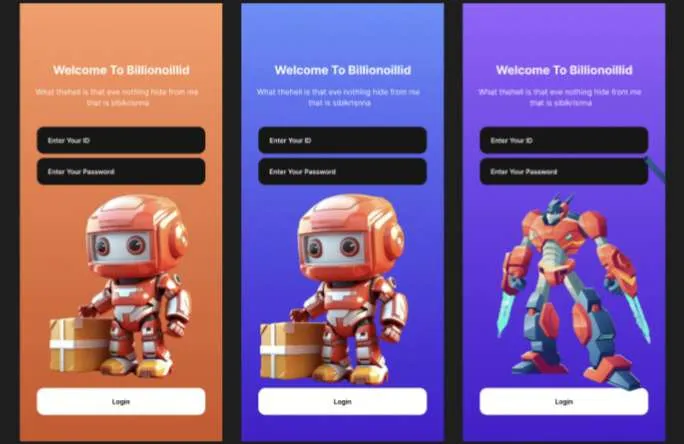
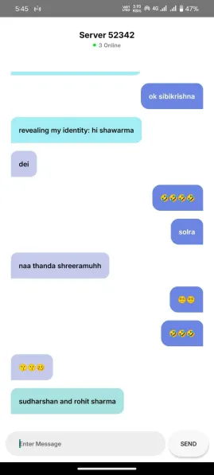
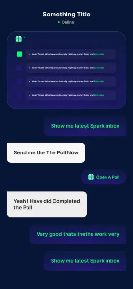

# Creating the markdown content for the README file

# 🔥 **Anonymous Chat Application** 🤫

Welcome to the **Anonymous Chat App**! It’s where your secrets are safe, your jokes fly freely, and your conversations stay between you, yourself, and the infinite void (well, also the other anonymous users 😜). Powered by **Socket.IO** and **Kotlin**, this app is built for those who just want to chat without knowing who is on the other side. No names. No faces. Just fun conversations!

## Features 🌟
- **Anonymous chatting**: No need to sign up or log in. Just chat and have fun! 💬
- **Real-time communication**: Thanks to **Socket.IO**, the conversations flow as smoothly as your coffee. ☕
- **Minimalistic design**: A simple, clean interface. Because who needs anything complicated when you're here for the jokes? 🎨

---

## Installation 🔧

> [!IMPORTANT]  
> To run this project locally, you will need **Kotlin** and **Socket.IO** set up on your machine. Don’t worry, you got this! 😎

1. Clone the repo
2. Install dependencies
3. Run the app and start chatting anonymously!

---

## Screenshots 📸

Here are some screenshots of the app in action! Behold the awesomeness:

> [!TIP]  
> **Pro tip**: Share the link with your friends, and the more people join, the more fun the chat becomes! 🎉

### LOGIN UI"S  
  

### LOGIN UI  
  

> [!CAUTION]  
> **Warning**: You might end up laughing too much. Please take regular breaks to prevent excessive fun! 😂  

---  

> [!NOTE]  
> **Note**: If you encounter any issues or just want to share your favorite joke, feel free to open an issue or contribute! 😄  

### Conversation View  
  

### Conversation View with Poll  
  

---

## Enjoy! 😜

Remember, this is an **anonymous** chat. No one knows who you are, but everyone knows you have a great sense of humor! So go ahead, crack those jokes, and enjoy your time. 😁

---

### Credits ✨
- Built with 🔥 by [Yuslash](https://github.com/Yuslash)
- Powered by **Socket.IO** and **Kotlin** 

